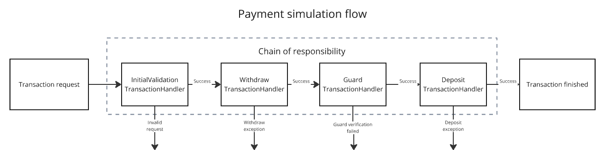

# Payment simulator

Simple payment simulator application. Simulates money transfer between two accounts with some additional checks in the meantime.

## Architecture and features

### Payment flow overview

Main `payment flow` designed according to `chain of responsibility` design pattern. `TransactionRequest` is passed into
chain of independent `TransactionHandler`s.

Assumptions:

- every transaction is traceable via set of `PaymentTransactionEvent`
- every `TransactionHandler` is responsible for specific isolated part of the `payment flow`
- every `TransactionHandler` decides if the given request will be passed to the next handler or proceeding will be finished at the
  moment
- every `TransactionHandler` executes idempotent operations (safe in case of re-execution)
- in case of system failure at any step `payment flow` will be retried 3 times for the given request
- in case of failed disaster recovery after retries as a fallback transaction will be reported (transaction event with type `REPORT` will
  be stored)
- `GuardTransactionHandler` verifies in `paralell` arbitrary number of checks (at the moment as an example there are two mocked
  guards: `FraudDetectionGuard` and `ComplianceGuard`)
- in case when any of transaction checks fail transaction will be blocked (transaction event with type `BLOCK` will be stored)
- at the moment application considered as internal service (minimal input data validation)

### Simplified payment flow overview



### Main aspects:

- money transfer stored as event log:
    - every transaction is traceable
    - in case of transaction check failure transaction is blocked
    - in case of system failure transaction is reported
- designed for failure:
    - bulkhead pattern on the input side
    - retryable `payment flow` with idempotent operations
    - partially prepared for integration with event-driven or messaging architecture
- `payment flow` design:
    - prepared for extension -> `chain of responsibility` design pattern
    - next transaction steps clearly isolated by `pl.varlab.payment.transaction.handler.TransactionHandler` interface
    - utilizes a few shorter (smaller) transactions instead of single long-running database transactions
- scalable, lightweight, modern:
    - synchronization point between instances has been designed on the database transaction level
    - `concurrent` transactions processing
    - `async` and `paralell` transaction verification checks (separate dedicated thread pool `guard` checks)
    - utilizes lightweight `java21 virtual threads`
    - uses modern java lang features like: `Records`, `String Templates`, `Text Blocks`, `Sealed Classes` etc.
- prepared for observability (`spring actuator`)
    - basic health status exposed on the `/api/actuator/health` endpoint
    - actual `@Retry` stats available on the `/api/actuator/retries` and `/api/actuator/retryevents` endpoints
    - actual `@Bulkhead` stats available on the `/api/actuator/bulkheads` and `/api/actuator/bulkheadevents` endpoints
- documented
    - `readme.md` file
    - `swagger-ui` and `OpenAPI` exposed on the `/api/swagger-ui/index.html`

### Prerequisites

If running with embedded in memory `H2` database, `Java21` should be the only one requirement.

You should be able to run the app via `maven wrapper`:

```bash
./mvnw spring-boot:run
```

### Running on `PostgreSQL`

Originally designed for `PostgreSQL`. To run with `PostgreSQL` you need to provide working `PostgreSQL` instance
and set `env` variables:

| Environment variable | Description                                    | Example                                   |
|----------------------|------------------------------------------------|-------------------------------------------
| DB_DRIVER_CLASS      | JDBC `PostgreSQL` driver class name            | org.postgresql.Driver                     |
| DB_URL               | JDBC `PostgreSQL` url to the payments database | jdbc:postgresql://localhost:5432/payments |
| DB_USERNAME          | Payments database username                     | databaseUsername                          |
| DB_PASSWORD          | Payments database username password            | secret                                    |

### Give it a try

When the app is running goto `swagger-ui`: http://localhost:8080/api/swagger-ui/index.html and navigate between available endpoints. 

Initial SQL script will create three example accounts with deposit on them.

You can get all the accounts balance via `/api/v1/accounts` endpoint.

Example request:
```
GET /api/v1/accounts HTTP/1.1
Host: localhost:8080
```

Example response:
```yaml
[
  {
    "name": "ACC1",
    "balance": 1000
  },
  {
    "name": "ACC2",
    "balance": 1100
  },
  {
    "name": "ACC3",
    "balance": 1200
  }
]
```

After accounts balance verification give a try to `transaction-controller`:

Example request:
```
POST /api/v1/transactions HTTP/1.1
Host: localhost:8080
Content-Length: 125

{
  "transactionId": "3fa85f64-5717-4562-b3fc-2c963f66afa6",
  "senderId": "ACC3",
  "recipientId": "ACC2",
  "amount": 100
}
```

You will get `200 OK` and empty body if everything goes well.

You can get also `422 Unprocessable Entity` with and error in the response body is something went wrong.
```
{
  "status": "UNPROCESSABLE_ENTITY",
  "message": "Fraud detected (divisor 11)"
}
```

You can rerun the same transaction many times but only with the same data.
If you change e.g. amount it'll be treated as `FraudException` and transaction will be blocked.

If you want push a few more transactions remember to always update `transactionId`!
then it'll be treated as new transaction.


### TODOs:

- `@CircuitBreaker` on the guards
- authentication
- authorization
- docker
- more unit tests
- more `@SpringBootTest` tests
- integration tests with `Testcontainers`
- account available funds endpoint
- compliance endpoint
- retry `async` mechanism
- event-driven platform integration